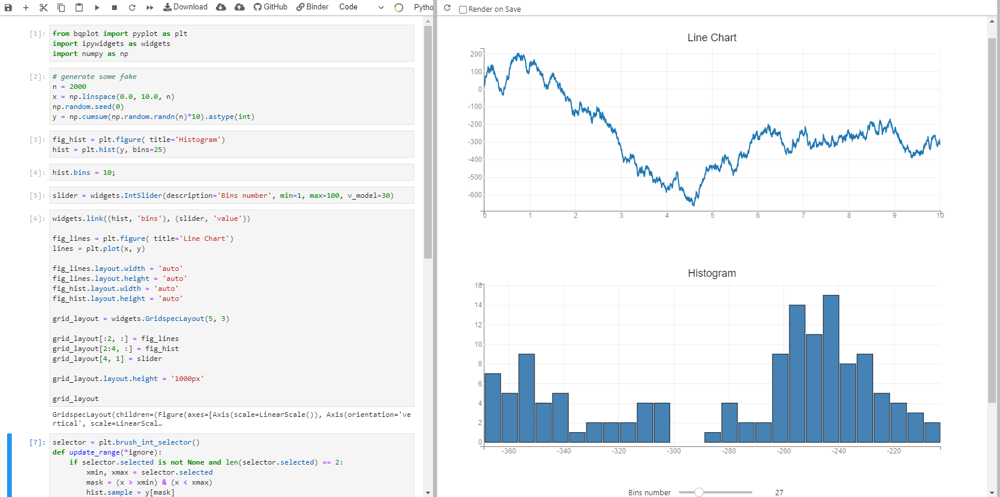
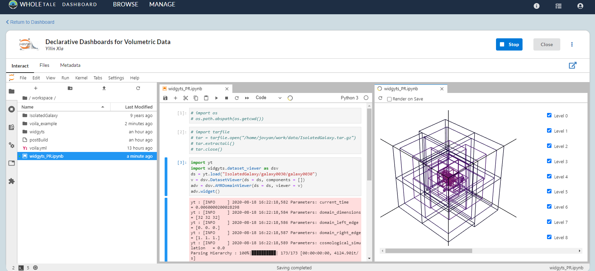

# Declarative Dashboards for Volumetric Data

## Project Overview
Phase 1  
This project will explore developing a custom front-end for volumetric (i.e., astrophysical, oceanographic, weather, finite element) data accessible to Whole Tale. This will include developing a dashboard of analysis methods on these datasets, and utilizing existing open source libraries for exposing methods to individuals.   
Phase 2 
The final result will be both a dashboard and a downloadable set of machine-readable representations of the current state of the dashboard, which can be re-ingested as a secondary tale.

## What is and Why Voilà

Voilà turns Jupyter notebooks into standalone applications and more dashboards can be found on [Voilà gallery](https://voila-gallery.org/).

**Challenges faced by Jupyter**
- not an ideal way to communicate with non-technical readers, who have to understand or re-execute the code to get insights
- security mode: users can interact with the noetbooks without arbitrary running code, which would easily brought up reproducibility problem

**Voilà Advantages**
* supporting Jupyter interactive widgets which means the bar to use voila is not that high
* Voilà does not permit arbitrary code execution by consumers of dashboards.
* Built upon Jupyter standard protocols and file formats, voilà works with any Jupyter kernel (C++, Python, Julia), making it a language-agnostic dashboarding system.
* Voilà is extensible. It includes a flexible template system to produce rich application layouts. 

## Voilà Components
As the previous part illustrates, the purpose of using Voilà is to generate a dashboard for interaction ultimately. So it is essential to figure out the components of one dashboard and what existing tools or packages or functions we can utilize without creating new ones.

**Ipyvuetify**  
Ipyvuetify is a widget library for making modern looking GUI’s in Jupyter notebooks (classic and lab) and dashboards (Voilà). It’s based on the Google material design philosophy best known from the Android user interface.

**Jupyter widgets**  
Jupyter widgets (widgets for short) are eventful python objects that have a representation in the browser, often as a control like a slider, textbox, etc. [From jupyter widgets official doc]. Most interactive visualization in jupyter would derive this pkg.

## Voilà Template
Experts in this field create many templates for people to use. Here we will introduce two main templates.
template usage `voila <path-to-notebook> --template=<name-of-template>`

**Voila-gridstack** [github](https://github.com/voila-dashboards/voila-gridstack)  
A template users can utilize to get the ideal dashboard simply by dragging and zooming the output of each cell.
`pip install git+https://github.com/voila-dashboards/voila-gridstack`
`voila --template=gridstack target_notebook --VoilaConfiguration.resources="{'gridstack': {'show_handles': True}}"`

**voila-vuetify**[github](https://github.com/voila-dashboards/voila-vuetify)  
A template you can use to design a "App" type dashboard and the fancy part for this dashboard is that you can arrange your dashboard structure within the jupyter notebook by writing python scripts.
`pip install bqplot ipyvuetify voila-vuetify`
`voila --template vuetify-default target_notebook`

## Repo Description
This repo will be used to store all the necessary files or scripts regarding the project described above.
 

**Milestone 2** Successfully set up environment in WT

 we successfully utilize all shell scripts from folder **"binder"** to set up the environment in WT (tale name "Declarative Dashboards for Volumetric Data")
 

**Milestone 1** Launch PR "dataset viewver" in Jupyter Lab with Voila

Here, we use binder (tight with repo2docker)to test our environement settings

## Interesting Questions

## Reference
QuantStack. (2019, September 25). And voilà! Retrieved August 10, 2020, from https://blog.jupyter.org/and-voil%C3%A0-f6a2c08a4a93

Buikhuizen, M. (n.d.). Mariobuikhuizen/ipyvuetify. Retrieved August 11, 2020, from https://github.com/mariobuikhuizen/ipyvuetify

https://voila-dashboards.github.io

## License

